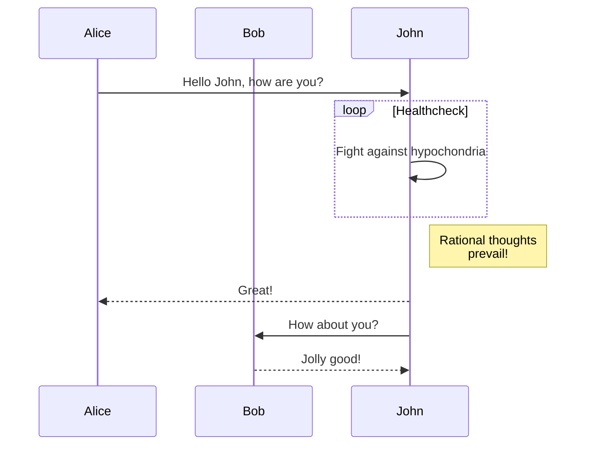

### Text Styles

**bold Text**   
`**bold Text**`  
`__Underline__`

*italicized text*  
`*italicized text*`

~~Strikethrough~~  
`~~Strikethrough~~`

### Lists

**Ordered List**  

```md
1. First item
2. Second item
3. Third item
```

1. First item
2. Second item
3. Third item

**Unordered List**

```
- First item
- Second item
- Third item
```

- First item
- Second item
- Third item

**Task List**

```
- [x] Write the press release
- [ ] Update the website
- [ ] Contact the media
```

- [x] Write the press release
- [ ] Update the website
- [ ] Contact the media

**Definition List**

```
term
: definition
```

term
: definition

### Wide Tables

A wide tables needs to be wrapped into a `div` with class `table-wrapper`
to make sure it displayed as expected on mobile devices. For example,

```markdown
<div class="table-wrapper" markdown="block">

|title1|title2|title3|title4|title5|title6|title7|title8|
|:-:|:-:|:-:|:-:|:-:|:-:|:-:|:-:|
|1|2|3|4|5|6|7|8|
|1|2|3|4|5|6|7|8|
|1|2|3|4|5|6|7|8|
|1|2|3|4|5|6|7|8|

</div>
```

Will be rendered as

<div class="table-wrapper" markdown="block">

|title1|title2|title3|title4|title5|title6|title7|title8|
|:-:|:-:|:-:|:-:|:-:|:-:|:-:|:-:|
|1|2|3|4|5|6|7|8|
|1|2|3|4|5|6|7|8|
|1|2|3|4|5|6|7|8|
|1|2|3|4|5|6|7|8|

</div>

### Tips, Warnings and Dangers

This jekyll-theme supports tips, warnings, and dangers blocks and the style is referred
from [the discord.js website][1].

You could have the following [markdown attributes (supported by kramdown)][2]:

#### Tips

Using a `{: .block-tip}` attribute:

```markdown
> ##### TIP
>
> This guide is last tested with @napi-rs/canvas^0.1.20, so make sure you have
> this or a similar version after installation.
{: .block-tip }
```

> ##### TIP
>
> This guide is last tested with @napi-rs/canvas^0.1.20, so make sure you have
> this or a similar version after installation.
{: .block-tip }

#### Warnings

Using a `{: .block-warning}` attribute:

```markdown
> ##### WARNING
>
> Be sure that you're familiar with things like async/await and object destructuring
> before continuing, as we'll be making use of features like these.
{: .block-warning }
```

> ##### WARNING
>
> Be sure that you're familiar with things like async/await and object destructuring
> before continuing, as we'll be making use of features like these.
{: .block-warning }

#### Dangers

Using a `{: .block-danger}` attribute:

```markdown
> ##### DANGER
>
> You cannot delete an ephemeral message.
{: .block-danger }
```

> ##### DANGER
>
> You cannot delete an ephemeral message.
{: .block-danger }

### Diagrams with mermaid.js

This jekyll-theme supports [mermaid.js](https://mermaid.js.org/) to render diagrams
in markdown.

To enable the mermaid support, you need to set `mermaid: true` in the front matter
of your post.

```markdown
---
title: Diagrams with mermaid.js
date: 2023-08-31
layout: post
mermaid: true
---
```

Then you can use mermaid syntax in your markdown:

```
graph TD;
    A-->B;
    A-->C;
    B-->D;
    C-->D;
```


Or, even some complex examples:

```
sequenceDiagram
    participant Alice
    participant Bob
    Alice->>John: Hello John, how are you?
    loop Healthcheck
        John->>John: Fight against hypochondria
    end
    Note right of John: Rational thoughts <br/>prevail!
    John-->>Alice: Great!
    John->>Bob: How about you?
    Bob-->>John: Jolly good!
```



Refer to the [mermaid.js website](https://mermaid.js.org/intro/) for more examples.

### MathJax and LaTeX

This jekyll-theme supports [MathJax](https://www.mathjax.org/) to render $\LaTeX$
and mathematics expressions.

> ##### TIP
>
> Currently, Kramdown uses double dollar sign delimiters for inline and display math:
> [https://kramdown.gettalong.org/syntax.html#math-blocks](https://kramdown.gettalong.org/syntax.html#math-blocks).
{: .block-tip }

e.g.,

```markdown
The well known Pythagorean theorem $x^2 + y^2 = z^2$ was
proved to be invalid for other exponents.
Meaning the next equation has no integer solutions:

$$ x^n + y^n = z^n $$
```

The well known Pythagorean theorem $x^2 + y^2 = z^2$ was
proved to be invalid for other exponents.
Meaning the next equation has no integer solutions:

$$ x^n + y^n = z^n $$

Another example with more complex markups:

```markdown
When $a \ne 0$, there are two solutions to $ax^2 + bx + c = 0$ and they are

$$x = {-b \pm \sqrt{b^2-4ac} \over 2a}.$$
```

When $a \ne 0$, there are two solutions to $ax^2 + bx + c = 0$ and they are

$$x = {-b \pm \sqrt{b^2-4ac} \over 2a}.$$

Refer to the [MathJax website](https://docs.mathjax.org/en/latest/index.html) for more examples.

### Footnotes

This jekyll-theme supports [MathJax](https://www.mathjax.org/) to render footnotes
in markdown.

```markdown
The well known Pythagorean theorem $x^2 + y^2 = z^2$ was
proved to be invalid for other exponents[^1].
Meaning the next equation has no integer solutions:

$$ x^n + y^n = z^n $$
```

The well known Pythagorean theorem $x^2 + y^2 = z^2$ was
proved to be invalid for other exponents[^1].
Meaning the next equation has no integer solutions:

$$ x^n + y^n = z^n $$


[^1]: [https://en.wikipedia.org/wiki/Fermat%27s_Last_Theorem](https://en.wikipedia.org/wiki/Fermat%27s_Last_Theorem)